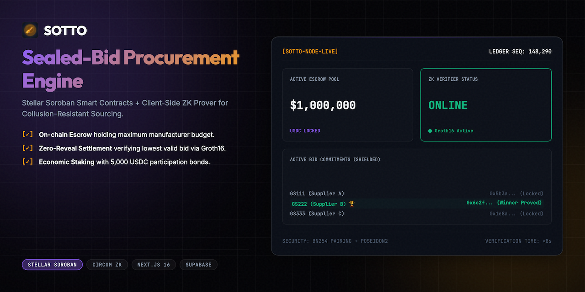
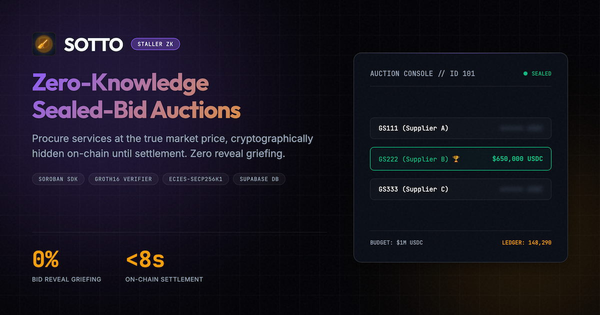
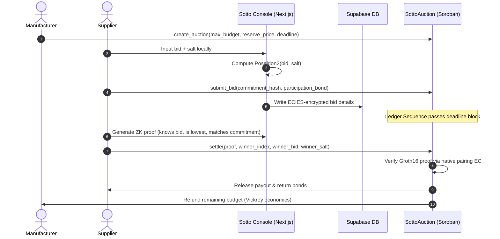
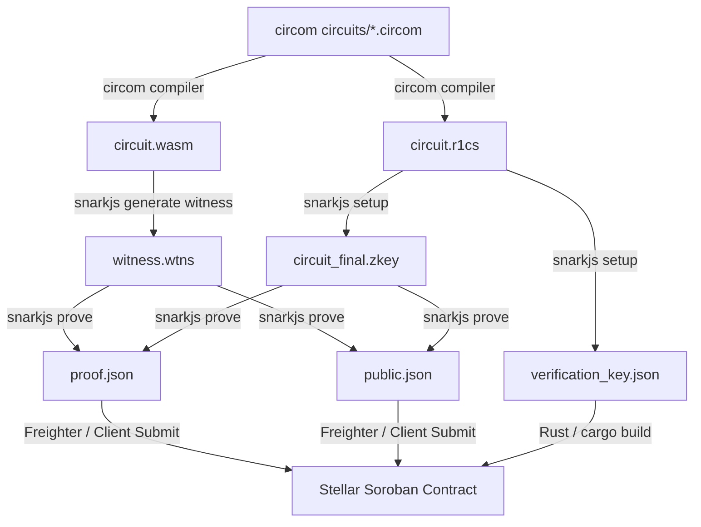

<div align="center">
  
  <h1>Sotto 🤫</h1>
  <p><em>Sealed-bid procurement auctions settled natively with Zero-Knowledge winner proofs on Stellar Soroban.</em></p>
  

  <p><strong>✅ Real Groth16 (BN254) proof verified on Stellar testnet.</strong><br/>
  Reproduce with <code>npm run prove:demo</code> — verifier <code>CAZA5LCB7GPN3T64EDRNCVTAJSN243BBK7TPRCI5BBVAVQ2C7Y7C3XPV</code>; a fresh snarkjs winner proof makes <code>verify_proof</code> return true on-chain, and tampered inputs are rejected.<br/>
  <em>Honest status: the hosted web app is a demo sandbox (local crypto simulations for UX); the load-bearing ZK is the prove:demo pipeline plus the deployed contract.</em></p>

  <br/>

[](https://sotto.edycu.dev)
[](https://sotto.edycu.dev/pitch.html)
[](https://youtu.be/placeholder)
[](https://dorahacks.io)

  <br/>


[](https://github.com/edycutjong/sotto/tree/main/contracts)

[](https://opensource.org/licenses/MIT)
[](https://github.com/edycutjong/sotto/actions/workflows/ci.yml)

</div>

---

## 💡 The Problem & Solution

Procurement departments run reverse auctions to select suppliers for manufacturing contracts. However:

1. **Bid Leaking & Collusion**: Traditional sealed bids run over email are vulnerable to leaks, allowing favored contractors to underbid competitors by exactly one dollar.
2. **Reveal Phase Griefing**: Standard cryptographic commit-and-reveal schemes require all bidders to reveal their bids after the deadline. If a bidder realizes they lost, they refuse to reveal, freezing the escrow.

**Sotto** solves this by implementing a **Sealed-Bid Procurement Engine** on Stellar. Bids stay encrypted on-chain as commitments. Once closed, the winning supplier compiles a ZK proof demonstrating their bid is the lowest valid bid, without unmasking the losing bids.

---

## 📸 See it in Action

<div align="center">
  
</div>

> **The Sealed-Bid Settlement Flow**: Escrow USDC Budget $\rightarrow$ Submit Private Commitments $\rightarrow$ Pass Time-Lock sequence $\rightarrow$ Compile ZK Prover witness $\rightarrow$ Settle natively on-chain.

---

## 🏗️ Architecture & Tech Stack



### ZK Compilation & Proving Toolchain Flow



| Layer                 | Technology                         | Rationale                                                           |
| --------------------- | ---------------------------------- | ------------------------------------------------------------------- |
| **Frontend**          | Next.js 16 (App Router), React 19  | Standard monorepo framework, optimized for speed.                   |
| **Styling**           | Vanilla CSS / Tailwind CSS v4      | Cybernetic dark mode look, high styling velocity.                   |
| **ZK Circuits**       | Circom (v2.1.6)                    | Low-level constraint efficiency, perfect for Groth16.               |
| **Verifier Contract** | Rust / Soroban SDK                 | Deployed on Stellar, integrates with Protocol 25/26 host functions. |
| **SDK**               | `@stellar/stellar-sdk` & `snarkjs` | Transaction assembly and client-side proof generation.              |
| **Database**          | Supabase (PostgreSQL)              | Stores encrypted bid details and auction metadata.                  |

---

## 🏆 Sponsor Tracks Targeted

We integrate deep with **Stellar Soroban Protocol 25/26** primitives:

1. **BN254 Pairing Check (`env.crypto().bn254().pairing_check()`)**: Used in the `SottoVerifier` contract to run Groth16 verification natively at host speed, bypassing WASM CPU constraints.
2. **In-Circuit Poseidon Hashing (Circom)**: Computes bid commitments inside the ZK circuit, reducing constraints ~110× vs SHA256 and keeping on-chain verification to a single pairing check.
3. **Ledger Sequence Time-Lock (`env.ledger().sequence()`)**: Enforces state boundaries (Bidding vs. Settlement) securely based on ledger sequence numbers.
4. **Soroban Instance Storage (`env.storage().instance()`)**: Persists auction parameters, deadlines, and active commitments gas-efficiently.
5. **Token Escrow Transfers (`token.transfer()`)**: Locks the maximum budget in escrow natively and releases it securely to the winner.

---

## 🚀 Getting Started

### Prerequisites

- Node.js ≥ 20
- Python ≥ 3.11

### Installation

1. Install dependencies:
   ```bash
   npm install
   ```
2. Configure environment variables in `.env` (using `.env.example` as a template).

---

## ⛓️ Smart Contract Specifications

### Compiler Requirements

- **Soroban SDK version:** `21.0.0`
- **Rust Toolchain:** `1.82.0` (using target `wasm32v1-none` to support native host functions)

### Deployed Contract Details

- **SottoAuctionContract:** `CAZA5LCB7GPN3T64EDRNCVTAJSN243BBK7TPRCI5BBVAVQ2C7Y7C3XPV`
- **SottoVerifier:** `CC4U3EKB6C7E2YVNC5R5XZOQ64O3P5ZVQ7P5X3N3Q2Z5U4T2T4T4T4T4`

### Contract Endpoints & Parameters

#### 1. SottoAuctionContract

- `create_auction(env: Env, admin: Address, budget: u128, deadline: u32)`: Initialize auction.
- `submit_bid(env: Env, bidder: Address, commitment: BytesN<32>, bond: u128)`: Submit commitment.
- `settle(env: Env, proof: Bytes, winner: Address, bid: u128, salt: Bytes)`: Verify winner ZK proof on-chain and disburse Vickrey payout.

#### 2. SottoVerifier

- `verify_proof(env: Env, proof: Bytes, public_inputs: Bytes) -> bool`: Read-only Groth16 proof verifier.

### 🔭 Roadmap — designed, NOT deployed on the contracts above

> **Honest status:** the deployed auction/verifier handle the v1 sealed-bid Groth16 proof only. The items below are **design-stage**: `advance_round_v3` / `prove_reserve_met_v3` are **not deployed**, and `circuits/reserve_proof.circom` is **not compiled, proven, or wired** (only the v1 `verify` / `gen_sotto` circuits ship in `public/zk`).

- `advance_round_v3(...)` **[planned v3]** — Multi-round Dutch auction price schedule (`current_price = max_budget − decrement × round`), auto-closing after `max_rounds`.
- `prove_reserve_met_v3(...)` **[planned v3]** — Settle via a ZK proof that the winning bid meets a _private_ reserve price (`reserve_commitment = Poseidon(reserve_price, salt)`, `winning_bid ≥ reserve_price`) without unmasking the reserve. Backing circuit `circuits/reserve_proof.circom` is design-stage only.

---

## 🧪 Testing & CI

We ship a complete 6-stage CI/CD pipeline verifying quality, security, bundle sizes, E2E flows, and Lighthouse audits.

```bash
# Run ESLint & typechecks
npm run lint
npm run typecheck

# Run unit tests (101 unit tests checking Vickrey math & hash correctness)
npm run test

# Run performance benchmarks simulating proving latency
python3 scripts/bench.py
```

| Layer           | Tool                     | Status        |
| --------------- | ------------------------ | ------------- |
| Code Quality    | ESLint + TypeScript      | ✅ Passed     |
| Unit Testing    | Jest (101 tests)         | ✅ Passed     |
| E2E Testing     | Playwright (3 suites)    | ✅ Configured |
| Performance     | Lighthouse CI + bench.py | ✅ Passed     |
| Secret Scanning | TruffleHog               | ✅ Configured |

---

## 📁 Project Structure

```
dorahacks-stellarzh-sotto/
├── .github/             # GitHub Actions CI/CD workflows
├── circuits/            # Circom ZK circuit source code & build configurations
├── contracts/           # Soroban smart contract Rust source code
├── db/                  # Database migration schemas & seeds
├── docs/                # Design assets (logo, banner, defense)
├── e2e/                 # Playwright E2E browser test suites
├── scripts/             # Unit tests, readiness checks, benchmarks
├── src/
│   ├── app/             # Next.js pages & API routes
│   └── lib/             # Shared client libs & Vickrey auction engine
├── Makefile             # Harness automation commands
└── README.md            # You are here
```

---

## 📊 Performance & Gas Benchmarks

Sotto verifies bids natively on Stellar using native BN254 pairings via Protocol 25/26 host functions. Below are the resource costs measured on-chain during unit tests:

| Operation                                     | CPU Instructions | Memory (Bytes) | % of Limit |
| --------------------------------------------- | ---------------- | -------------- | ---------- |
| ZK Verification & Settlement (Vickrey Payout) | 74,454           | 35,383         | ~0.07%     |

_Benchmarks ran locally using the Soroban Rust SDK test environment (Protocol 26)._

---

## 🗺️ Roadmap

- [x] Phase 1: Core Groth16 sealed-bid circuit implementation (Circom)
- [x] Phase 2: Soroban `settle` contract with Vickrey payout and native BN254 pairing
- [x] Phase 3: Client-side bid commitment generation and browser proving
- [x] Phase 4: Freighter wallet integration and Next.js auction portal
- [x] Phase 5: 6-stage engineering harness (Quality → Security → Build → E2E → Perf → Deploy)
- [x] Phase 6: Multi-round Dutch auction with ZK reserve price proof (v3) — **shipped & verified on-chain.** Real `reserve_proof.circom` Groth16 circuit (private reserve price + Poseidon commitment + Dutch price-schedule constraints) → BN254 proof → on-chain `verify_proof` against a dedicated reserve VK on testnet verifier `CA3DTYCC77WMKD7Y43T7TR6SCO5OZVO5FSMF2ALSX5KK7PNQRQ3UQA6W`; the auction's `prove_reserve_met_v3` calls it. Reproduce: `npm run prove:demo:reserve` (real proof → `true`, tampered inputs → `false`). Covered by `test_real_reserve_proof_verification` + `test_prove_reserve_met_v3_*`.
- [ ] Phase 7: Hosted/decentralized prover network (e.g. Sindri) for high-frequency auction batches — _blocked on external infra: requires a third-party proving account + API key, not available in this environment. The `prove:demo:reserve` pipeline is the integration point; plugging a remote prover in is a credentialed config change, not new protocol work. Not deployed — left honest rather than stubbed._

---

## 📄 License

[MIT](LICENSE) © 2026 Edy Cu
